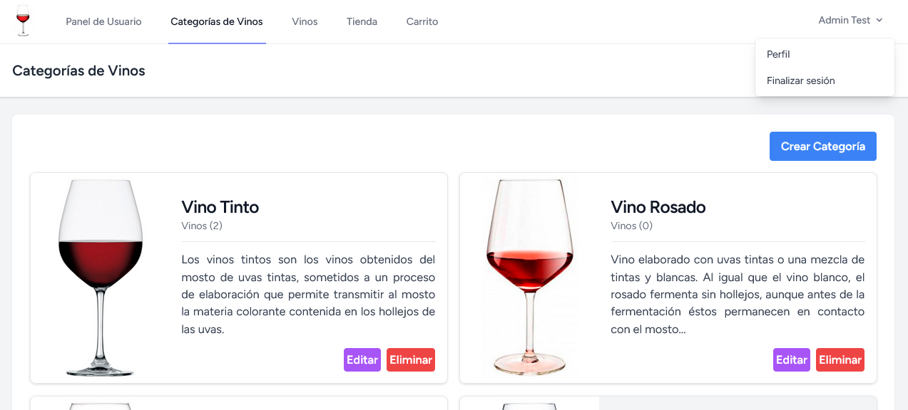
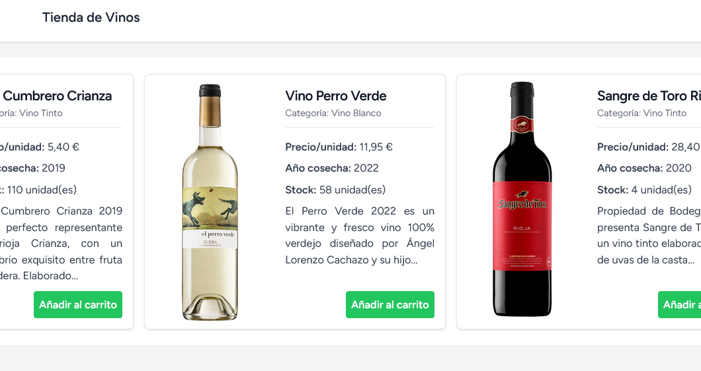
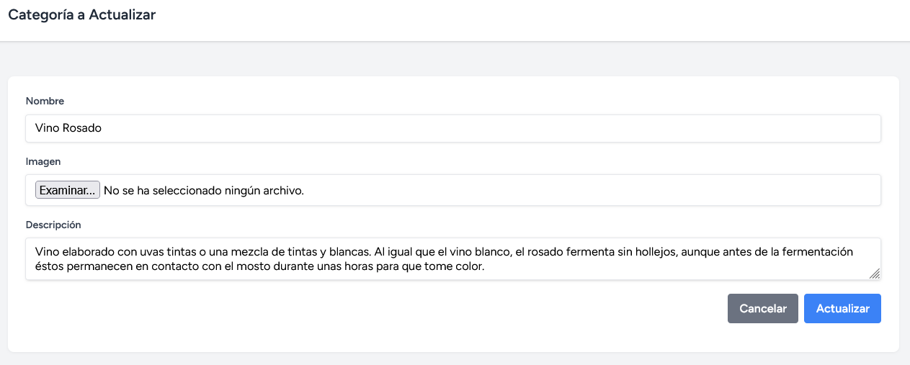
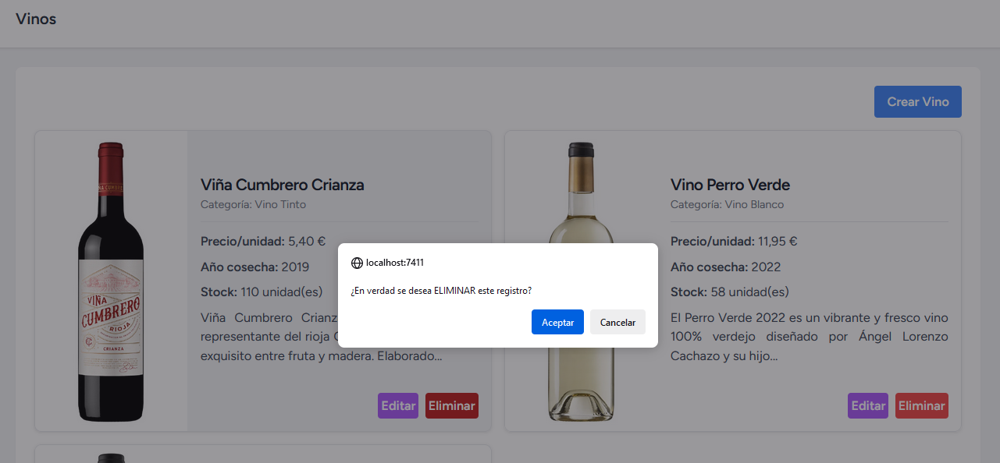
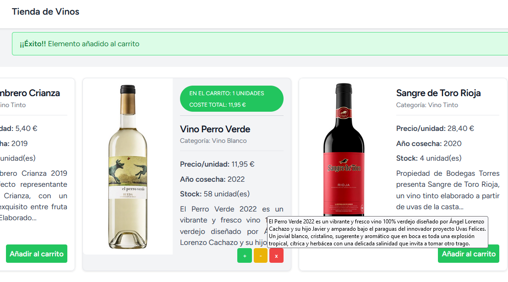
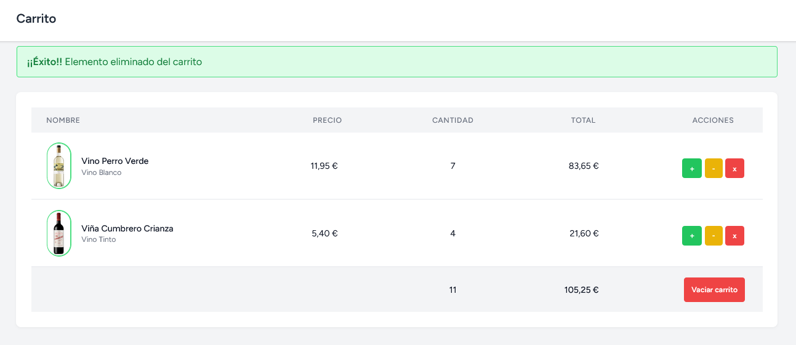
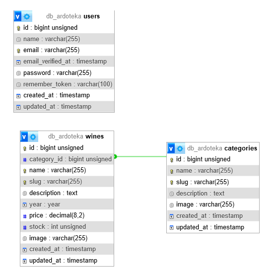

## ArdoTeka

A grandes rasgos, se trata de una aplicación con sistema de gestión de productos para ofrecer un catálogo de vinos a los usuarios registrados con posibilidad de añadirlos al típico carrito de compras.

Pero lo importante llevado a cabo, de forma interna en este proyecto, es la implementación de buenas prácticas durante el desarrollo, así como uso de patrones de diseño y reutilización de código.

### Funcionalidades técnicas

Algunas de las técnicas empleadas:

- Uso del Patrón Repository.
- Inversión de Dependencias.
- Empleo de Traits para dinamizar las operaciones de CRUD para todo lo común que tengan los modelos implicados.
- Reutilización de componentes Blade.
- Implementación de servicios para las tareas relativas a la gestión del carrito y las imágenes.

#### Tests

Además, se realizaron diversos tests para comprobar la implementación del carrito de compra mediante Pest Framework:

- Unit Tests, para verificar que el carrito de compras funciona correctamente.
- Feature Tests, para verificar la interacción que el usuario pueda ejercitar sobre dicho carrito de compras.

#### Otros

Por último, a nivel de servicio de Docker Compose, este proyecto dispone de la herramienta [Buggregator](https://buggregator.dev/), como sistema para realizar DEBUG en proyectos de PHP.

### Funcionalidades de Usuario

Existen varias acciones que podrá realizar el usuario según el nivel de acceso que tenga dentro de la aplicación.

#### Respecto al Sistema de Gestión

Implementado el típico sistema de CRUD para que el administrador del sitio pueda gestionar los diferentes productos de la aplicación.

#### Respecto al Tienda y el Carrito

Menos la conexión a una pasarela de pago, el Carrito de Compras ofrece ciertas de las siguientes funcionalidades al usuario:

- Añadir/eliminar productos del Carrito.
- Incrementar/decrementar cantidades.
- Mostrar diversas cantidades relativas a producto(s) añadido(s) (cantidades, coste, totales, ...).
- Poder vaciar el contenido del Carrito.
- ...

### Modelo de Datos

